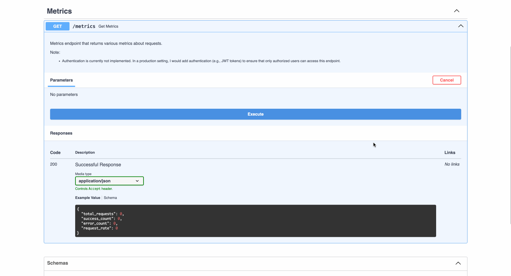

# Content Moderation MVP

## Overview

This project is a simple MVP for content moderation using a Hugging Face model. It processes classification requests, runs inference locally, and returns moderation categories along with their confidence scores. Additionally, I have stated the resources used in the `resources.txt` file for tracking.



## Features

- Downloads and uses the `KoalaAI/Text-Moderation` model for content filtering.
- Provides an API endpoint to classify text for moderation.
- Tracks the number of requests per second through logging.
- Provides an API endpoint to fetch usage metrics.

## Setup

### Prerequisites

- Docker

### Running the Service

```sh
docker compose up --build
```

This will build and start the FastAPI service, and it will also run the tests.

## API Documentation

Once the service is running, you can access the API documentation at:

- OpenAPI Docs: [http://localhost:8000/docs](http://localhost:8000/docs)
- ReDoc: [http://localhost:8000/redoc](http://localhost:8000/redoc)

## Assumptions

- The model is downloaded and cached locally.
- PyTorch is used for model inference.
- The response format was not predefined.
- Requests per second tracking is implemented via logging for simplicity.
- Proper authentication is not required for this MVP, as it is not exposed to the public internet.
- Extensive unit tests are not required for this MVP.

## Future Improvements

- Implement message broker integration (e.g., Celery and RabbitMQ) to handle tasks asynchronously and improve scalability.
- Implement monitoring and tracing for better observability and performance insights.
- Add alerting systems to notify about critical issues.
- Add authentication and authorization mechanisms for secure access.
- Improve error handling and logging to capture detailed diagnostics.
- Deploy the service to a cloud environment for production readiness.
- Optimize response times for better performance.
- Store moderation results in a database (e.g., PostgreSQL or BigQuery) for persistence and further analysis.
- Integrate GitHub Actions for automated test runs and deployments, ensuring continuous integration and delivery.
